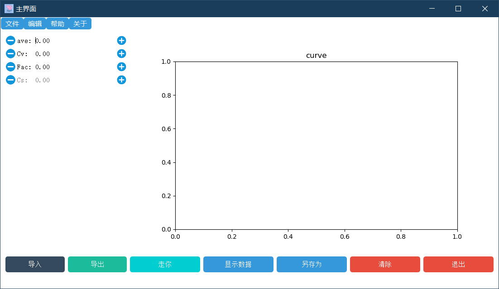
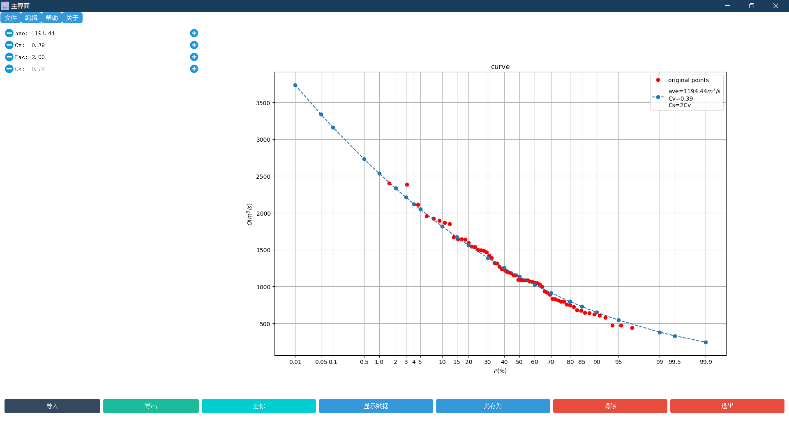
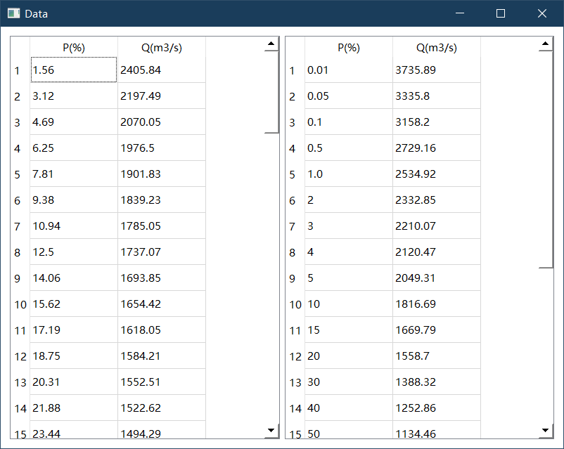

# 水文频率曲线拟合软件使用说明
- 作者：刘彦龙
- 学校：武汉大学
- 指导教师：艾学山、万颷

[toc]

## 简介
本软件可以实现水文频率曲线($P-$)的拟合，并可以手动调整，实时显示拟合曲线。

本程序采用`Python`结合`PyQt5`编写。
## 界面介绍

主界面包括菜单栏、输入栏、底部菜单、右侧绘图区。
## 使用方法
### 数据要求与导入
您可以选择`.csv`或者`.xls`格式数据导入，不过推荐使用`.csv`格式文件，数据包括两列，第一列为年份(或者您自己选定的时段)，第二列为流量数据，示例数据可见`1.csv`。
当导入数据以后程序自动开始计算，如果您的操作与数据无误，此时界面绘图区会出现拟合图像。如下图:

### 手动微调
当对拟合结果不满意，您可以选择手动微调，您可以选择调整`ave、Cv、fac`来优化拟合结果，其中$Cs=fac*Cv$，也就是说您不必手动调整`Cs`。
### 显示拟合表格
当上述数据导入成功并获得图像，您可以点击`显示数据`，此时会弹出表格窗口，左侧为经验频率，右侧为理论频率。

### 另存为
若您想将图像保存，可以点击`另存为`按钮并根据提示操作。
### 清除
若您想清除图像，请点击`清除`按钮。
### 退出
点击`退出`按钮退出程序。
## 结语
本软件为`数据库与水利应用开发`课程的个人作品，感谢艾学山老师、万颷老师的指导，本软件也在一定程度上借鉴了万老师的同款软件，秉承开源精神，本软件开源，您可以在[这里]()找到本软件的源码，由于初次接触界面开发，还有许多不足之处，您如果有任何的建议可以前往本项目的`Github`页面提交`issue`.
最后，感谢您的使用。